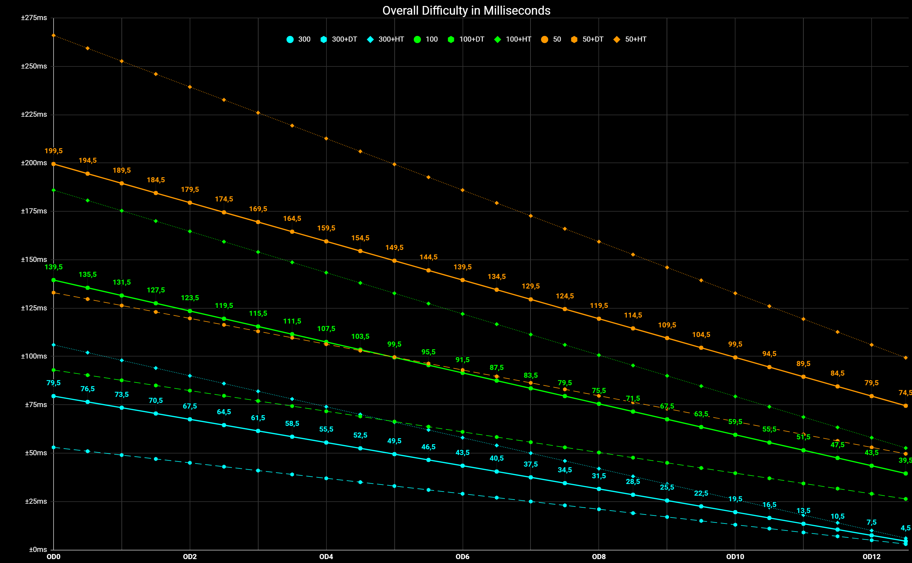

+++
title = "High Responsive Game / 高响应性游戏"
description = ""
draft = false

[taxonomies]
tags = ["Game development", "Rhythm Game"]

[extra]
feature_image = "thumbnail.png"
feature = true
link = "" 
+++

## 引言

头图来自于音乐节奏游戏 [osu!](https://en.wikipedia.org/wiki/Osu!) 内

osu! 最开始由澳大利亚人 Dean Herbert (aka. peppy or ppy) 开发，主要由社区运营。

在 osu! 内有一个帧率指示器用于显示当前的帧数。开发者显示了帧生成时间 ( 1000ms / fps )，使用了毫秒作为单位，导致很多玩家误以为它代表游戏的整体延迟。固然帧生成是游戏延迟的一部分，但是与输入设备以及游戏本身逻辑的时延相比是微不足道的。久而久之形成了一个梗。

音乐游戏最主要的游戏体验来源于玩家的操作节奏与音乐节奏的共鸣，而合适的响应能给输入带来更强烈的反馈。这样的游戏我姑且称为高响应性游戏，游戏体验以及游戏操作上限与游戏响应度高度挂钩。

同样的还有 FPS/TPS 竞技射击类游戏，在我心目中 Overwatch/Valorant 两个射击游戏在优化游戏响应性方面做得相当优秀。这两个游戏立项之初就为正式的竞技比赛做准备，作为大型在线竞技射击游戏，不止要解决本地游戏端的优化，网络架构也需要精心的设计来满足高实时性的需求。

本文会以我接触时间比较长的两个游戏作为实例分析，**osu!** 和 **Overwatch** ，同时分别代表了两种不同类型的游戏

## 游戏性 Gameplay

由 From Software 开发的开放世界角色扮演游戏《艾尔登法环》，一经发售便获得了广泛好评，但是我下载后游戏时间不到2h便受不了退出了游戏。主要原因就是操作的预输入导致难以适应。而从开发者的角度来说，这就是他们设计游戏时对游戏性提出的要求。玩家应该为每个操作负责。

如果你在动作中按下另一个操作的输入，游戏会将指令放入队列，等待上一个动作完成接着执行下一个，而且不能取消。最直观的表现就是会乱滚，因为你无意间按了很多次闪避。同时游戏内的各种怪物攻击频率很容易就能抓到你翻滚空隙。这就是游戏性故意设置的延迟，为的就是限制你不要乱滚。

而在音游这边，事情便是另一个极端。随着难度提升带来的操作密度上升，延迟和卡顿是不能忍受的.

图为 osu! 在不同难度下的判定区间

可以看出其完美判定区间（300）平均值已经来到了 50ms 左右，意味着你的输入误差必须在 50ms 以内

Synthesizing 0/10 solutions