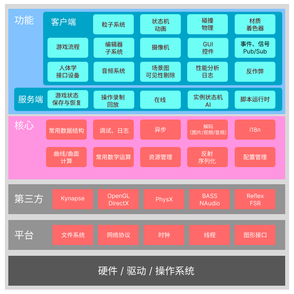
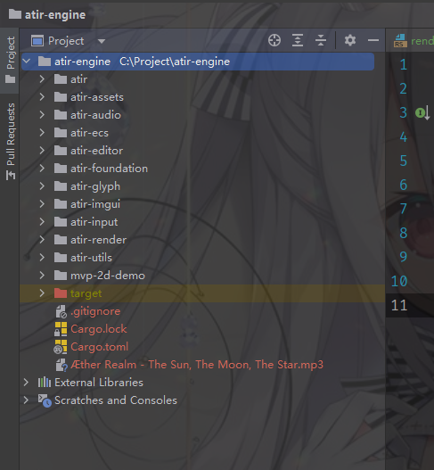

+++
title = "ATIR / 一个学习向游戏引擎"
description = ""
draft = false

[taxonomies]
tags = ["Game development", "Rhythm Game", "Game Engine"]

[extra]
feature_image = "IMG_20220528_221059.jpg"
feature = true
link = "" 
+++

本文主要记录立项调研内容，决定最终方向的各种考虑

该项目旨在学习，完善过程中可能会出现巨大结构变动或者风格差异

## 需求

多线程

可视化 Editor

ECS 架构 （Entity Component System）

## 大纲

图中只展示了部分系统，实际复杂度可能远不止此，仅做讲解设计思路参考

（注，第三方内容并不是实际技术选型，只是为了展示该层宏观定位）

首先我会问自己游戏引擎是什么以及我想要什么。

游戏引擎提供一个提供一系列工具、核心框架，使开发人员无需重复构建基础设施，甚至忽略平台差异进行高效的制作。

在曾经，游戏和引擎的划分界线往往非常模糊。
早期受限于硬件性能以及兼容性，引擎通常只满足游戏设计最低限度的功能实现。那时的引擎不能算是通用引擎。

现如今各种引擎Unreal，Unity，Godot都试图为用户提供尽可能多的通用性。

GAMES 104 课程里有一段让我印象深刻，王希老师说到：

“ 游戏引擎是生产力工具，游戏引擎的用户不仅仅是程序员，真正最大的用户群体是设计师和艺术家 ”

游戏引擎本质上是一系列工具链的集合，什么游戏需要什么样的工具，更多的工具固然好，但会不会带来额外的性能开销，这是在设计时应该考虑的。

## 项目结构

### atir

程序入口模块，包含编辑器入口和游戏入口，游戏主循环在此构建

### atir-assets

资源管理模块，为资源分配句柄；管理各种文件格式导入导出；序列化等功能。

### atir-audio

音频模块，使用原生 Bass 库实现，提供 dsound, WASAPI, ASIO 多种后端

### atir-ecs

Entity Component System 实现，基于 hecs 封装

### atir-editor

编辑器实现，基于 egui；

### atir-foundation

基础功能组件库，常用数据结构，网络功能，事件系统等

### atir-glyph

提供字符、字体渲染功能

### atir-imgui

imgui 实现，提供便捷的 GUI 功能

### atir-input

输入事件库，包括键盘、鼠标、Joystick等

### atir-render

渲染库，基于 wgpu (WebGPU 的 Rust 实现)，提供Vulkan, Dx12, 等多种后端

### atir-utils

工具库，提供 logger, Profiler 等工具

