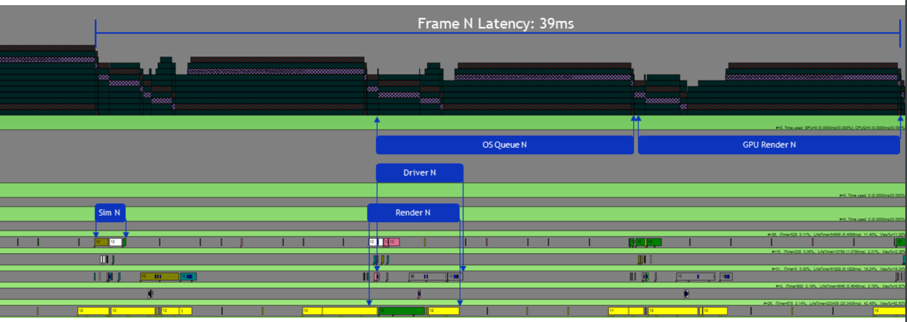
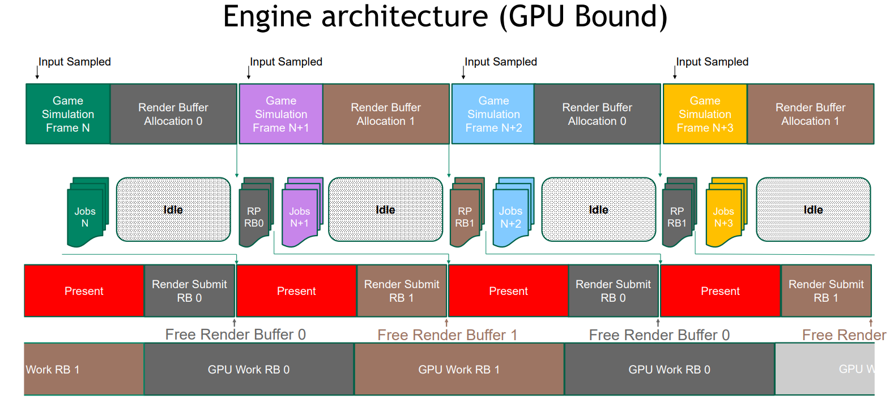

+++
title = "atir Progress Report"
description = ""
draft = false

[taxonomies]
tags = ["Game development", "Game Engine"]

[extra]
feature_image = "screenshot026.jpg"
feature = true
link = "" 

+++

# Intro

半年前就有了想要写一个小引擎的想法，出发点是重写一个名为[osu](https://github.com/ppy/osu)的音乐游戏，Use Rust.

## Why

osu 目前分为了两个主要版本，osu-stable（闭源，大部分人正在玩的主流通道）、osu-lazer（开源，建设中并且即将完成，计划明年推向公众）

### stable 与 lazer

stable 代码设计简单，没有过多的抽象，但是历史积累原因导致这团代码成为了名副其实的屎山。严重不合理的继承、缝缝补补的控制流、网络结构设计不合理、2023 年 irc 协议最后的荣光。导致**这份代码**[^1]的维护以及新功能的建设难度非常大。

Lazer 于 2017 年立项开始设计，ppy 的目标是跨平台，可扩展，现代化UI，并且拥有完整的覆盖测试。目前看来确实做得很不错。而且 Lazer 的 **渲染/音频/输入/游戏逻辑** 现在分别拥有独立的线程。在stable里，如果你的电脑配置不是那么好，帧率严重影响到输入输出，造成延迟。

但是，还是有一个但是。在软件工程里，灵活与性能一般是无法兼得的。lazer 为了实现跨平台和可扩展性牺牲了很多。在我的机器上，Lazer能跑出**400**[^2]帧左右的帧率（而且波动幅度大），与之对比，stable是**1000+**[^3]

[^1]: ppy曾经迫于反作弊系统舆论压力于2016年公开过一次stable代码，我们现在维护的版本是基于2016 fork改动并基本追上latest
[^2]: 400fps 意味着 2.5ms 的帧生成时间加上2.5ms的update时间，考虑到高难度图的缩圈速度和判断区间，这不是一个小数字
[^3]:  osu-stable 使用的 .net framework 以及 osu-lazer 使用的 .net core 可能会由于过高的帧率出现 GC choke 造成掉帧，此现象 .net core可能更严重，这也是为什么 lazer 没有提供无限制帧率

## So

借着[Games104课程](https://games104.boomingtech.com/sc/)的劲，我打算用 Rust 来实现一个玩具引擎，并且借助她构建一个新的音乐游戏

## Why Rust

Rust 是一门赋予每个人构建可靠且高效软件能力的语言。--  Rust语言官网

系统级语言在设计得当的情况下有更好的性能表现。无GC，不存在 GC jitter ( 依旧需要考虑 memory allocation pressure，有 Arenas 等解决方案 )

wgpu: WebGPU 标准的 Rust 实现，使得跨平台与跨图形API成为可能

Finally，我的私心。谁让我是Rust小鬼（逃）

# 规划

## 编辑器

在计划一开始我就把编辑器开发当做首要目标，没有编辑器的游戏引擎开发效率将十分低下。尤其是Rust语言出了名的编译速度慢（其实重复编译只需要更新单个crate的编译速度可以接受）。每次应用的更改都要重新编译，进入游戏，触发对应逻辑。如果没有达到预期效果，那么又是一轮重新编译。显然这是极其痛苦的开发流程。编辑器的存在，让部分改动可以预览到，节省大量的时间。

## 状态脚本

游戏使用了ECS(Entity Component System)架构，我直接使用了 bevy 引擎的bevy_ecs，所有`System`存储在 `Stage`里由`Schedule`调度运行。在bevy原有架构中，所有 system 都是 Rust 中的函数 ，在编译期确定，没有动态的调试方法。既然提到了编辑器，动态的游戏逻辑(`system`)调整也成为了刚需。

### 什么是状态脚本

StateScript. 出自 [ GDC - 2017 Overwatch 团队的演讲 ](https://www.youtube.com/watch?v=5jP0z7Atww4) 

Overwatch 团队用这种节点图的形式表达一个“英雄”的技能，事件的信号沿着边传递给相连的节点，触发一系列事件，最终组成了一个技能。包括：

如何释放技能（UserInput，Event）

释放技能的条件（Bool）

技能的CD（Timer）

技能效果（Animation，Translation，Damage ）

而复杂节点也可以由基础节点组合而来，例如 Animation 本质上就是 Time 和 Translation 组合的结果.

游戏引擎只需要提供基础节点类型，在运行时由开发者自行组合提交给引擎运行。

实际上节点图的概念已经在很多地方实际应用了，UnrealEngine的蓝图，Unity 的 GraphShader，Blender 的 GraphShader，都是连接简单节点组合成复杂输出的概念应用。它不需要额外运行时，不需要考虑引入其他脚本语言带来的性能问题，直观易于调试。

## 渲染图（RenderGraph）

在GPU渲染管线里，GPU的一次完整执行称为一个Pass。大部分情况下，单靠一次Pass是不能渲染出完整场景的，第n+1个Pass往往需要第n个Pass的输出作为输入。此时通常会引入类似FrameBuffer的概念，将前一个Pass的输出保存起来。

当渲染流程较为单一的时候，传统架构结构还是比较清晰的。但是只要提到资源（Buffer）的相互引用，已经可以想象到当渲染管线愈发复杂时，资源的生命周期管理，资源的依赖关系缠作一团乱麻（强耦合），很难管理。

其实我打算额外写一篇文章讨论 RenderGraph ，但水平受限，很多细节理解还不到位，所以一直咕咕咕。

大致概括一下 RenderGraph 的几个首要目标/优势

上图是我自己跑的一个渲染图可视化

+

从数据结构上来说，RenderGraph是一个有向无环图。**它包括**[^4]：

- 节点：用于生成 draw calls 或者运行自己内部的SubGraph
- 边：定义节点之间的顺序，以及将上游节点的输出连接到下游节点的输入

特点：

- 各个顶点（节点）完全独立存在，无相互调用
- 良好的可扩展性
- 易于Debug
- 多线程开发友好

[^4]: 实际上渲染图不止一种实现思路，只要是类似利用有向无环图结构解耦顶点间依赖关系的结构都能被称作渲染图

## 多线程&Reflex

单线程架构游戏的输入、逻辑、绘制均在一个线程。这样虽然易于开发，但是当玩家对游戏输入极为苛刻的时候，这样的结构显然应付不住了。

多线程带来的潜在问题：如何协调渲染线程和游戏逻辑线程

国内没有关于Reflex的资料，几乎只是知道这玩能降低延迟，不如就借此机会写一篇解释吧

### 什么是输入延迟

我们从硬件外设到显示器的过程开始：

- 外设输入：回报率，键盘消抖算法
- USB 硬件：Hub控制器
- USB 总线
- 操作系统
- 游戏Sampling：游戏输入线程，输入缓冲
- 游戏逻辑：逻辑运行时间，预输入
- 渲染任务提交
- 渲染队列
- 渲染
- 合成：Windows窗口合成、Overlay、DWM
- 扫描输出：显示器刷新率
- 像素响应

### Reflex 要解决的问题是什么

如上图所示

`Sim N`代表第N帧的游戏逻辑（注意，此时的场景是GPU bound，GPU负载相对较大）`Render N`标签下方与`Sim N`同轴的即为`Sim N+1`

`Render N`所在的渲染线程处理 Render prep 工作，并不是实际的GPU渲染。

而实际第N帧的渲染，直到39ms后的图末尾才完成，但这并不代表着每帧的帧生成时间是39ms。仔细观察此图

 `Sim N+1` 实际上在`Render N`附近就已经开始，每一次 Sim 都意味着一帧的创建。在此图中，渲染任务线程和渲染线程分别落后了Sim线程 1，2 个单位的帧生成时间。

图中红色斜杠为 `Present()`为Win32API 即向用户呈现一个渲染完成的图像。必须等到`N-2`帧的显示结束，才能开展此帧的渲染准备工作(`Render N`),

于是，在`Sim N` 和 `Sim N+1`之间，我们观察到了大量的空隙，称作CPU Back Pressure

了解了这张图后，终于可以说到Reflex发挥作用的地方了

从Input Sample的一刻开始，第N帧的游戏逻辑（Simulation）准备完成，但是我们不知道此刻GPU的工作状态，只能等待 Present 结束，然后开始Submit渲染任务。

Reflex 提供了一些API，能让我们得知GPU的状态。在逻辑线程上插入 `NVAPI_D3D_Sleep()` ，乍一看 `Sleep()` 是严重影响性能的行为，但是别忘了这是GPU Bound的场景，我们一直都在等待GPU完成任务，但是苦于无法明确得知GPU任务状态，只能用`Present()`等手段等待显示的完成。

此时`Render N`的提交精准的与上一帧结束对齐，大大降低了CPU backpressure

总结：Reflex 适用于多线程游戏、GPU bound 场景，用于调整游戏逻辑（Simulation）线程的渲染任务提交时间，使其与上一帧渲染结束时间对齐，减小了从输入采样到实际渲染的等待时间。

## ASIO

一般讨论游戏音频开发，有大量针对游戏的完善解决方案可以用，但是讨论音游，还是不得不提一个独特的API: ASIO

ASIO 一般在专业音频制作领域比较常见，消费级硬件产品基本没有搭载，也没有必要。其特点之一： 极低的输出延迟[^5]，使得音乐游戏能从中极大受益。

[^5]: 10毫秒以下，硬件环境环境较佳甚至1毫秒以下

# 总结以及进度报告

其实整篇文章下来都显得有那么一点“魔怔”，很多奇怪的需求，这怎么看都不像是一个初创项目该做的事，但是我热爱这些工作，圈子里管我们叫“低延迟魔怔人”。我很乐意搞清楚是什么导致游戏延迟，其中的技术，这样我也有底气传授别人经验。而不是道听途说各种参数，外设，最后默默在 Aimlab 启动项里填一个 m_rawinput 0[^6]

新建文件夹开始到现在已经有两个月了，大量时间都花在了调研和学习上。不过好消息是基础框已经确定，有bevy engine这种优秀项目参考（实际上是直接用了人家的几个模块）。几个难点（RenderGraph, StateScript, EditorSystem）攻克后剩下的就是大量的搬砖工作，希望我不忘初心，能把这个项目坚持下去。

[^6]: m_rawinput 是起源引擎的配置项，用于设置鼠标rawinut，但是Aimlab基于unity Engine制作，并且不提供类似启动项配置

